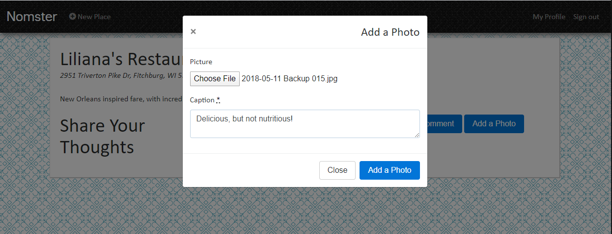

# Nomster

Nomster allows users to log in, create places on the page, and upload pictures or comments.

This application was created as part of the University of Wisconsin Extension Bootcamp.

## User Stories

As an anonymous user, I want to:
  * See a complete list of restaurants so that I can determine where to eat
  * See pictures of food uploaded by other users so that I can see the food or restaurant
  * See comments made by other users to see if it fits my preferences
  * See the location of the restaurant on a map so that I can find it easily

As an authenticated user, I want to:
  * Create a place on the site so that I can share my opinion
  * Update the decsription of places I created so that I can keep them up-to-date
  * Add comments to places created by others so that I can share my opinion
  * Add pictures to places created by others so that I can show what the food or place looked like
  * Receive emails when someone places a comment or picture on a place I created so that I can see what others' think 

## How to run the application:

### Production
Navigate to the production location of [Nomster](https://radiant-savannah-23956-ed8410181269.herokuapp.com/)

#### All Users
1. To sign up, sign in, or log out, use the hyperlinks in the navigation bar:
  
2. All users are able to view places uploaded by other users on the front page, as well as the detail page:
  
3. If the owner entered a valid address, you will see a map of the location of the place on the page:
  

#### Authenticated Users
1. To create a place on the site, select "New Place":
  
2. You can view the option to edit a place you have created on the view page:
  
3. To edit a place you have created, select "Edit" on the places page and update content:
  
4. For all places, you are able to add comments to the place by clicking "Add a Comment" and filling in the form:
  
5. For all places, you are able to upload photos by clicking "Add a Photo" and selecting a file:
  
6. You can see all of your activity from "My Profile":
  

## High Level Specs
Nomster allows users to post favorite restaurants, review restaurants, and upload pictures related to them. Authenticated users are able to upload, comment, and edit items they uploaded. Unauthenticated users are able to view content uploaded by others.

### Application Specs
Nomster is a Ruby on Rails application, with a database is managed by Postgres
* Rails v. 5.2.3
* Ruby v. 2.5.3

### Integrations Used

The following gems support Nomster's functionality:
* Devise, for user authentication
* Geocoder, to support Google's geocoder API
* Figaro, for controlling environment variables
* Carrierwave, for photo upload
* fog-aws, for storing photos on Amazon Web Services
* Pagy, for limiting index pages to 10 entries
* Font-Awesome, for graphics
* Bootstrap, for page layout
